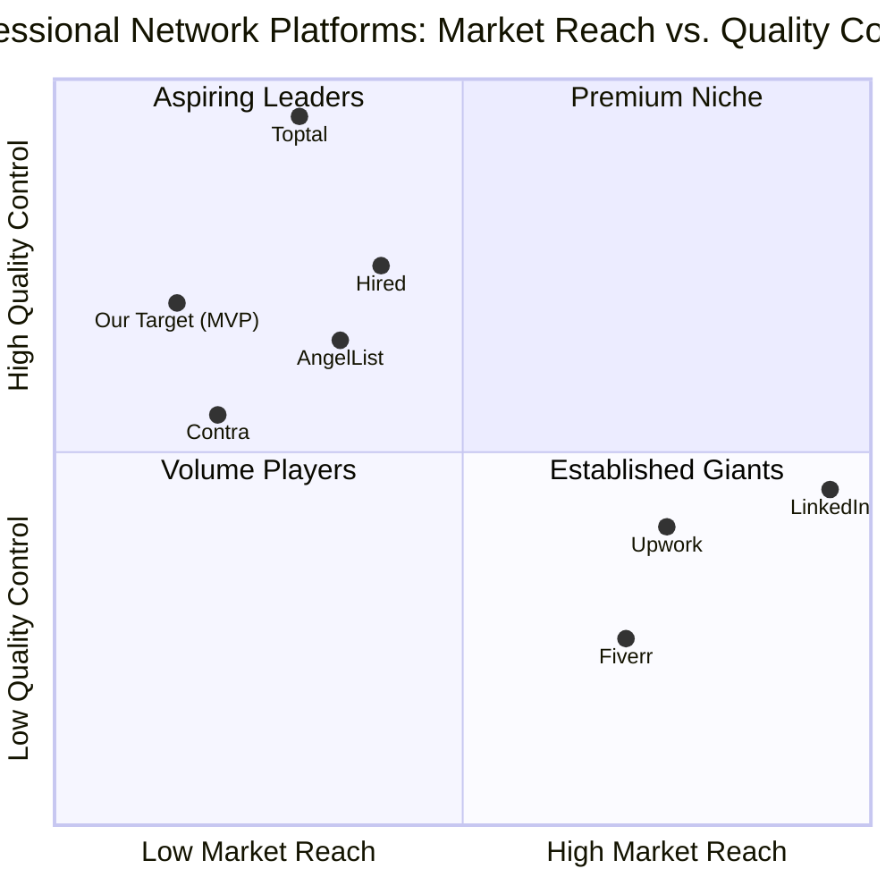

# Product Requirements Document (PRD)
# AI-Powered Professional Network - Phase I (MVP)

## 1. Language & Project Information

**Language:** English  
**Programming Language:** TypeScript, React, Node.js, PostgreSQL  
**Project Name:** ai_professional_network_mvp  
**Document Version:** 1.0  
**Last Updated:** 2025-10-27

### Original Requirements Restatement

Create an AI-powered professional networking platform that connects professionals with companies through a two-sided marketplace. The MVP (Phase I - Validation stage) focuses on establishing core marketplace functionality with basic user profiles, keyword search, messaging, project posting/application flow, and a simple transaction system. The platform aims to validate market demand and achieve initial liquidity in a targeted niche market before scaling.

## 2. Product Definition

### 2.1 Product Goals

1. **Establish Market Liquidity**: Achieve a balanced two-sided marketplace with sufficient supply (professionals) and demand (companies) to enable meaningful transactions within the first 6 months of launch.

2. **Validate Core Value Proposition**: Demonstrate that the platform effectively connects qualified professionals with relevant project opportunities, resulting in measurable hiring outcomes and user satisfaction.

3. **Build Foundation for AI Integration**: Create a robust data collection and user interaction framework that will support future AI-powered matching and recommendation features in subsequent phases.

### 2.2 User Stories

**For Professionals:**

1. As a professional seeking project opportunities, I want to create a comprehensive profile showcasing my skills and experience, so that companies can discover and evaluate my qualifications.
   - **Acceptance Criteria:**
     - Profile includes name, headline, bio, skills, experience, education
     - Ability to upload profile photo
     - Skills can be added via tags/keywords
     - Profile is publicly viewable after completion

2. As a professional, I want to search and browse available project postings using keywords, so that I can find opportunities matching my expertise.
   - **Acceptance Criteria:**
     - Search bar accepts keyword input
     - Results display project title, company, description preview, budget range
     - Filter by project type, budget, timeline
     - Results update in real-time as filters are applied

3. As a professional, I want to apply to projects that interest me, so that I can be considered for opportunities.
   - **Acceptance Criteria:**
     - One-click application submission
     - Ability to include a cover letter/proposal
     - Confirmation message after submission
     - View application status (pending, reviewed, accepted, rejected)

4. As a professional, I want to communicate with companies through a secure messaging system, so that I can discuss project details and negotiate terms.
   - **Acceptance Criteria:**
     - Real-time messaging interface
     - Message history preserved
     - Notification when new messages arrive
     - Ability to share files/documents

5. As a professional, I want to receive payment securely through the platform, so that I can trust the transaction process.
   - **Acceptance Criteria:**
     - Connect payment method (bank account/PayPal)
     - View transaction history
     - Receive payment confirmation
     - Platform handles commission deduction automatically

**For Companies:**

1. As a company hiring manager, I want to create a company profile, so that professionals can learn about my organization and trust the opportunities I post.
   - **Acceptance Criteria:**
     - Profile includes company name, logo, description, industry, size
     - Ability to add company website and social links
     - Profile is publicly viewable
     - Verification badge for authenticated companies

2. As a company, I want to post project opportunities with detailed requirements, so that I can attract qualified professionals.
   - **Acceptance Criteria:**
     - Form includes project title, description, required skills, budget, timeline
     - Ability to set project as public or invite-only
     - Preview before publishing
     - Edit or close project after posting

3. As a company, I want to search for professionals using keyword filters, so that I can proactively find candidates for my projects.
   - **Acceptance Criteria:**
     - Search by skills, experience level, location
     - View professional profiles in search results
     - Save/bookmark interesting profiles
     - Invite professionals to apply to specific projects

4. As a company, I want to review applications and communicate with candidates, so that I can evaluate fit and make hiring decisions.
   - **Acceptance Criteria:**
     - Dashboard showing all applications per project
     - Ability to mark applications as shortlisted/rejected
     - Integrated messaging with applicants
     - Schedule interviews or calls through the platform

5. As a company, I want to make secure payments through the platform, so that I can compensate professionals efficiently.
   - **Acceptance Criteria:**
     - Add payment method (credit card/ACH)
     - Release payment milestones
     - View invoice and payment history
     - Receive receipts for tax purposes

### 2.3 Competitive Analysis

#### 1. LinkedIn
**Strengths:**
- Massive user base (900M+ professionals)
- Strong brand recognition and trust
- Comprehensive professional networking features
- Robust job posting and recruitment tools
- Rich company pages and content ecosystem

**Weaknesses:**
- Not project-focused; primarily full-time employment
- Limited transaction/payment infrastructure
- Overwhelming noise and spam for users
- Generic matching without AI-powered precision
- High cost for premium features and recruiter tools

#### 2. Upwork
**Strengths:**
- Established freelance marketplace with proven model
- Built-in payment protection and escrow system
- Time tracking and project management tools
- Large pool of freelancers across many categories
- Review and rating system builds trust

**Weaknesses:**
- High platform fees (20% for new freelancers)
- Race to the bottom on pricing
- Quality inconsistency among freelancers
- Complex interface overwhelming for new users
- Limited focus on high-skilled professional projects

#### 3. Toptal
**Strengths:**
- Premium positioning with vetted top 3% talent
- High-quality professional network
- Strong screening and matching process
- Focus on software developers, designers, finance experts
- White-glove service for enterprise clients

**Weaknesses:**
- Extremely selective (97% rejection rate)
- High cost for companies
- Limited talent pool due to strict vetting
- Slow onboarding process for professionals
- Not accessible for mid-level professionals

#### 4. Fiverr
**Strengths:**
- Easy-to-use platform with low barrier to entry
- Package-based pricing simplifies transactions
- Strong brand for quick, affordable services
- Global marketplace with diverse services
- Fast turnaround for simple projects

**Weaknesses:**
- Perceived as low-quality/budget marketplace
- Not suitable for complex professional projects
- Limited relationship-building features
- Commoditization of professional services
- Minimal vetting of service providers

#### 5. AngelList (Wellfound)
**Strengths:**
- Strong focus on startup ecosystem
- Direct connection between startups and talent
- Equity compensation options
- Curated job opportunities
- Community of early-stage companies and professionals

**Weaknesses:**
- Limited to startup/tech industry
- Primarily full-time roles, not project-based
- Smaller user base compared to LinkedIn
- No built-in payment or transaction system
- Limited international reach

#### 6. Contra
**Strengths:**
- Commission-free for freelancers
- Modern, clean interface
- Portfolio-focused professional profiles
- Built-in contract and payment tools
- Growing community of independent professionals

**Weaknesses:**
- Relatively new with smaller user base
- Limited enterprise features
- No AI-powered matching yet
- Less established trust compared to competitors
- Fewer project categories outside creative/tech

#### 7. Hired (now part of Vettery)
**Strengths:**
- Reverse job marketplace (companies apply to candidates)
- Focus on tech talent
- Transparent salary information
- Curated matching process
- Strong vetting of both sides

**Weaknesses:**
- Limited to full-time employment
- Not project or freelance focused
- Restricted to specific industries (tech, sales)
- Requires approval to join platform
- No transaction/payment infrastructure

### 2.4 Competitive Quadrant Chart



**Positioning Strategy:**
Our MVP positions in the "Aspiring Leaders" quadrant, focusing on high quality control with intentionally limited initial reach. We target a specific niche (e.g., tech professionals in AI/ML or data science) to establish strong quality standards and marketplace liquidity before expanding reach.

## 3. Technical Specifications

### 3.1 Requirements Analysis

The AI-Powered Professional Network MVP requires a robust, scalable two-sided marketplace platform that balances simplicity with essential functionality. The system must support:

**Core Infrastructure:**
- User authentication and authorization with role-based access (Professional, Company, Admin)
- Secure data storage for user profiles, projects, applications, and messages
- Real-time communication capabilities for messaging
- Payment processing integration with commission/fee calculation
- Search and filtering engine for professionals and projects
- Responsive web application accessible across devices

**Data Management:**
- Structured data models for users, companies, projects, applications, messages, transactions
- Efficient querying for search and filtering operations
- Data validation and sanitization for security
- Audit logging for compliance and debugging

**User Experience:**
- Intuitive onboarding flows for both user types
- Clean, modern UI following best practices
- Fast page load times and responsive interactions
- Clear navigation and information architecture
- Mobile-responsive design

**Security & Compliance:**
- HTTPS encryption for all communications
- Secure password storage (hashing and salting)
- PCI DSS compliance for payment processing
- GDPR and CCPA compliance for data privacy
- Protection against common vulnerabilities (SQL injection, XSS, CSRF)

**Scalability Considerations:**
- Database design supporting future growth
- API architecture allowing for mobile app development
- Modular codebase for feature additions
- Performance monitoring and optimization

### 3.2 Requirements Pool

#### P0 (Must-Have for MVP Launch)

1. **User Authentication & Authorization**
   - Email/password registration and login
   - Role-based access control (Professional, Company, Admin)
   - Email verification for new accounts
   - Password reset functionality
   - Session management and secure logout

2. **Professional Profile Management**
   - Create and edit profile with name, headline, bio, skills, experience, education
   - Upload profile photo
   - Add skills via tags/keywords (minimum 3, maximum 20)
   - Public profile view accessible via unique URL
   - Profile completion indicator

3. **Company Profile Management**
   - Create and edit company profile with name, logo, description, industry, size
   - Add company website and social media links
   - Company verification process (email domain verification)
   - Public company page view

4. **Project Posting & Management**
   - Create project with title, description, required skills, budget range, timeline
   - Edit and close/archive projects
   - Set project visibility (public or invite-only)
   - View list of applications per project
   - Mark applications as shortlisted, rejected, or accepted

5. **Project Search & Discovery**
   - Keyword search for projects by title, description, skills
   - Filter by budget range, timeline, project type
   - Sort by date posted, budget, relevance
   - Pagination for search results
   - Save/bookmark projects (for professionals)

6. **Professional Search & Discovery**
   - Keyword search for professionals by skills, experience
   - Filter by experience level, availability
   - View professional profiles from search results
   - Save/bookmark professionals (for companies)
   - Invite professionals to apply to specific projects

7. **Application Management**
   - One-click apply to projects
   - Include cover letter/proposal with application
   - View application status (pending, reviewed, shortlisted, rejected, accepted)
   - Application history for professionals
   - Application dashboard for companies

8. **Messaging System**
   - Real-time one-on-one messaging between professionals and companies
   - Message thread history
   - Unread message indicators and notifications
   - Basic file attachment support (documents, images)
   - Message search within conversations

9. **Payment Processing Core**
   - Stripe integration for payment processing
   - Add and manage payment methods (credit card for companies, bank account for professionals)
   - Create payment transactions with commission deduction (10-15% platform fee)
   - Transaction history and receipts
   - Basic escrow functionality (hold payment until project completion)

10. **Dashboard & Navigation**
    - Professional dashboard: active applications, messages, saved projects
    - Company dashboard: active projects, applications, messages, saved professionals
    - Top navigation with quick access to key features
    - Notification center for important updates

11. **Admin Panel**
    - View and manage users (professionals and companies)
    - Review and approve company verifications
    - Monitor platform activity and transactions
    - Handle user reports and disputes
    - Basic analytics dashboard (user counts, project counts, transaction volume)

#### P1 (Should-Have for Enhanced MVP)

1. **Enhanced Profile Features**
   - Portfolio/work samples upload for professionals
   - Video introduction (30-60 seconds)
   - Certifications and licenses
   - Language proficiency indicators
   - Availability calendar

2. **Advanced Search & Filters**
   - Location-based search and filtering
   - Experience level filtering (junior, mid, senior, expert)
   - Hourly rate or project budget preferences
   - Industry-specific filters
   - Save search queries for future use

3. **Reviews & Ratings**
   - 5-star rating system for completed projects
   - Written reviews from companies for professionals
   - Written reviews from professionals for companies
   - Display average rating on profiles
   - Review moderation and dispute resolution

4. **Enhanced Messaging**
   - Read receipts
   - Typing indicators
   - Rich text formatting
   - Voice message support
   - Schedule messages for later

5. **Notifications System**
   - Email notifications for key events (new application, message, payment)
   - In-app notification center
   - Customizable notification preferences
   - Push notifications (web push)

6. **Project Milestones**
   - Break projects into milestones with separate payments
   - Milestone approval workflow
   - Progress tracking per milestone
   - Partial payment releases

7. **Analytics & Insights**
   - Profile view analytics for professionals
   - Project view analytics for companies
   - Application success rate metrics
   - Search ranking insights
   - Engagement metrics

8. **Onboarding & Tutorials**
   - Interactive onboarding flow for new users
   - Feature tooltips and guided tours
   - Help center with FAQs and tutorials
   - Video tutorials for key features

#### P2 (Nice-to-Have for Future Iterations)

1. **AI-Powered Matching**
   - Automated project recommendations for professionals
   - Automated professional recommendations for companies
   - Smart skill extraction from resumes/profiles
   - Predictive success scoring for matches

2. **Social Features**
   - Professional networking (connect with other professionals)
   - Activity feed showing platform updates
   - Share projects or profiles on social media
   - Endorsements for skills

3. **Advanced Payment Features**
   - Multiple currency support
   - Cryptocurrency payment option
   - Subscription plans for companies (unlimited postings)
   - Discounts and promotional codes

4. **Contract Management**
   - Digital contract templates
   - E-signature integration
   - Contract negotiation workflow
   - Legal document storage

5. **Video Conferencing**
   - Built-in video call functionality
   - Interview scheduling and reminders
   - Call recording (with consent)
   - Screen sharing

6. **Mobile Applications**
   - Native iOS app
   - Native Android app
   - Mobile-optimized features
   - Offline mode support

7. **API & Integrations**
   - Public API for third-party integrations
   - Integration with LinkedIn for profile import
   - Integration with GitHub for developers
   - Integration with calendar apps (Google Calendar, Outlook)

8. **Gamification**
   - Achievement badges for professionals
   - Leaderboards for top-rated professionals
   - Streak tracking for active users
   - Rewards program for referrals

### 3.3 UI Design Draft

#### Key Screens & Layouts

**1. Landing Page**
- Hero section with value proposition and CTA buttons ("Join as Professional" / "Hire Talent")
- Feature highlights (3-4 key benefits)
- How it works section (step-by-step for both user types)
- Featured professionals carousel
- Recent project postings
- Trust indicators (number of users, projects completed, testimonials)
- Footer with links to About, FAQ, Terms, Privacy

**2. Registration & Onboarding**
- Role selection (Professional or Company)
- Email/password registration form
- Email verification step
- Profile completion wizard (multi-step form)
  - Professional: Basic info → Skills → Experience → Review
  - Company: Basic info → Company details → Verification → Review
- Welcome dashboard after completion

**3. Professional Dashboard**
- Left sidebar: Navigation menu (Dashboard, Profile, Projects, Applications, Messages, Settings)
- Main content area:
  - Quick stats cards (Profile views, Active applications, Messages)
  - Recommended projects section
  - Recent activity feed
  - Application status overview
- Right sidebar: Notifications and tips

**4. Company Dashboard**
- Left sidebar: Navigation menu (Dashboard, Company Profile, Post Project, Applications, Messages, Settings)
- Main content area:
  - Quick stats cards (Active projects, Total applications, Hired professionals)
  - Active projects list with application counts
  - Recent applications
  - Saved professionals
- Right sidebar: Notifications and quick actions

**5. Professional Profile Page**
- Header: Profile photo, name, headline, location, availability status
- About section: Bio/summary
- Skills section: Tag cloud or list
- Experience section: Timeline format
- Education section
- Portfolio/work samples (if available)
- Reviews and ratings
- CTA button: "Message" or "Invite to Project"

**6. Company Profile Page**
- Header: Company logo, name, tagline, industry, size
- About section: Company description
- Company details: Website, social links, location
- Active projects section
- Reviews from professionals
- Verification badge
- CTA button: "View Projects"

**7. Project Posting Form**
- Multi-step form:
  - Step 1: Project basics (title, description)
  - Step 2: Requirements (skills needed, experience level)
  - Step 3: Budget and timeline
  - Step 4: Visibility settings (public/invite-only)
  - Step 5: Review and publish
- Auto-save draft functionality
- Preview option

**8. Project Detail Page**
- Project header: Title, company name (with logo), posted date
- Project description
- Required skills (tags)
- Budget range and timeline
- Application count
- CTA button: "Apply Now" (for professionals) or "Edit Project" (for company owner)
- Similar projects section

**9. Search Results Page**
- Search bar with filters (collapsible sidebar on mobile)
- Filter options: Budget, timeline, skills, experience level, location
- Sort options: Relevance, Date posted, Budget
- Results grid/list view toggle
- Result cards showing:
  - Project: Title, company, description preview, budget, skills
  - Professional: Photo, name, headline, skills, rating
- Pagination or infinite scroll

**10. Application Management**
- For professionals: List of applications with status badges
- For companies: Applicant cards with key info
  - Photo, name, headline, applied date
  - Quick actions: View profile, Message, Shortlist, Reject
- Filters: All, Pending, Shortlisted, Rejected, Accepted
- Bulk actions for companies

**11. Messaging Interface**
- Left panel: Conversation list with search
- Main panel: Message thread with input box
- Right panel: Conversation info (participant details, shared files)
- Real-time message updates
- File attachment button
- Emoji picker

**12. Payment & Transaction Pages**
- Payment method management: Add/remove cards or bank accounts
- Transaction history: Table with date, project, amount, status
- Invoice detail view: Downloadable PDF
- Payment release workflow for companies
- Payout request for professionals

#### Design Principles

- **Clean & Modern**: Minimalist design with ample white space
- **Consistent**: Unified color scheme, typography, and component styling
- **Accessible**: WCAG 2.1 AA compliance, keyboard navigation, screen reader support
- **Responsive**: Mobile-first approach, breakpoints for tablet and desktop
- **Fast**: Optimized images, lazy loading, skeleton screens for loading states
- **Intuitive**: Clear labels, helpful tooltips, logical information hierarchy

#### Color Scheme (Suggested)
- Primary: Blue (#2563EB) - Trust, professionalism
- Secondary: Green (#10B981) - Success, growth
- Accent: Purple (#8B5CF6) - Innovation, creativity
- Neutral: Gray scale (#F9FAFB to #111827)
- Error: Red (#EF4444)
- Warning: Yellow (#F59E0B)

#### Typography
- Headings: Inter or Poppins (bold, semi-bold)
- Body: Inter or Open Sans (regular, medium)
- Code/Technical: Fira Code or Roboto Mono

### 3.4 Open Questions

1. **Niche Market Selection**
   - Which specific professional niche should we target for MVP launch? (e.g., AI/ML engineers, data scientists, UX designers, digital marketers)
   - What geographic market should we prioritize? (e.g., US-only, North America, English-speaking countries)
   - Should we limit to specific industries for companies initially? (e.g., tech startups, agencies)

2. **Pricing Strategy**
   - What commission rate should we charge? (10%, 15%, 20%?)
   - Should we offer a subscription option for companies instead of per-transaction fees?
   - Will there be a free tier or trial period?
   - How do we handle refunds or disputes?

3. **Quality Control**
   - Should we implement a vetting process for professionals before they can apply to projects?
   - How do we verify company legitimacy beyond email domain verification?
   - What criteria determine if a professional or company should be removed from the platform?
   - Should we limit the number of applications a professional can submit per day/week?

4. **Matching Algorithm (Future)**
   - What data points should we collect during MVP to train future AI matching models?
   - Should we implement a basic scoring system in MVP or wait for AI integration?
   - How do we balance algorithmic recommendations with user autonomy?

5. **User Acquisition**
   - What is our customer acquisition cost (CAC) target for MVP?
   - Which marketing channels should we prioritize? (Content marketing, paid ads, partnerships, referrals)
   - Should we offer referral incentives? If so, what structure?
   - Do we need a waitlist or can we launch with open registration?

6. **Legal & Compliance**
   - Do we need to register as a payment processor or can we rely entirely on Stripe?
   - What legal disclaimers are required for the platform?
   - How do we handle international users and varying labor laws?
   - What insurance or liability protection do we need?

7. **Data & Analytics**
   - What analytics tools should we integrate from day one? (Google Analytics, Mixpanel, Amplitude)
   - What are the key metrics we need to track daily/weekly?
   - How do we ensure user privacy while collecting necessary data?
   - Should we implement A/B testing infrastructure in MVP?

8. **Technical Infrastructure**
   - What is our expected traffic and how do we plan for scaling?
   - Should we use a monolithic architecture or microservices for MVP?
   - What is our disaster recovery and backup strategy?
   - How do we handle database migrations as we evolve the schema?

9. **Support & Community**
   - What level of customer support can we provide during MVP? (Email only, chat, phone)
   - Should we build a community forum or rely on social media?
   - How do we handle disputes between professionals and companies?
   - What is our response time SLA for support tickets?

10. **Feature Prioritization**
    - Should reviews/ratings be in MVP or can they wait for post-MVP?
    - Is video introduction essential for MVP or nice-to-have?
    - Do we need project milestones in MVP or can we start with single-payment projects?
    - Should we build mobile apps alongside web MVP or web-first?

## 4. Target Niche Market Definition

### 4.1 Initial Target Segment

**Primary Niche: AI/ML and Data Science Professionals**

**Rationale:**
- High-demand, rapidly growing field with talent shortage
- Projects are well-defined and measurable
- Professionals are tech-savvy and early adopters
- Companies actively seeking specialized talent
- Higher budget projects justify platform fees
- Strong potential for word-of-mouth growth within community

**Professional Segment Characteristics:**
- **Experience Level**: Mid to senior level (3+ years experience)
- **Skills**: Machine learning, deep learning, NLP, computer vision, data engineering, MLOps
- **Location**: Initially US-based, English-speaking
- **Work Preference**: Open to project-based work, consulting, or fractional roles
- **Motivation**: Seeking flexibility, higher rates, interesting problems, portfolio building

**Company Segment Characteristics:**
- **Company Type**: Tech startups (Series A-C), scale-ups, innovation labs at enterprises
- **Industry**: SaaS, fintech, healthtech, e-commerce, AI-first companies
- **Size**: 20-500 employees
- **Location**: US-based, primarily tech hubs (SF Bay Area, NYC, Seattle, Austin, Boston)
- **Pain Point**: Difficulty hiring full-time AI/ML talent, need for specialized project work
- **Budget**: $5,000-$50,000 per project, willing to pay premium for quality

### 4.2 Market Size Estimation

**Total Addressable Market (TAM):**
- US AI/ML professionals: ~300,000
- Companies seeking AI/ML talent: ~50,000
- Global AI market size: $196B (2023), growing at 37% CAGR

**Serviceable Addressable Market (SAM):**
- Mid-senior AI/ML professionals open to project work: ~50,000
- US tech companies actively hiring for AI/ML projects: ~10,000
- Project-based AI/ML market: ~$5B annually

**Serviceable Obtainable Market (SOM) - MVP Target:**
- Year 1 target: 500 professionals, 100 companies
- Projected GMV (Gross Merchandise Value): $2-5M
- Platform revenue (15% commission): $300K-$750K

### 4.3 Go-to-Market Strategy

#### Phase 1: Pre-Launch (Months 1-2)

**Objective**: Build anticipation and secure early adopters

1. **Waitlist Campaign**
   - Create landing page with value proposition and waitlist signup
   - Target: 1,000 professionals, 200 companies on waitlist
   - Offer early access incentives (reduced commission for first 3 months)

2. **Content Marketing**
   - Launch blog with AI/ML career and hiring content
   - Publish 2-3 high-quality articles per week
   - Guest posts on relevant platforms (Towards Data Science, HackerNoon)
   - SEO optimization for "AI ML freelance", "hire AI engineer", etc.

3. **Community Building**
   - Create LinkedIn company page and start posting
   - Join and engage in AI/ML communities (Reddit r/MachineLearning, Discord servers)
   - Identify and reach out to potential brand ambassadors

4. **Partnership Outreach**
   - Connect with AI/ML bootcamps and training programs (e.g., Coursera, DataCamp)
   - Reach out to startup accelerators (Y Combinator, Techstars)
   - Explore partnerships with AI/ML conferences and events

#### Phase 2: Soft Launch (Month 3)

**Objective**: Validate product with select users and gather feedback

1. **Invite-Only Beta**
   - Invite top 100 professionals and 20 companies from waitlist
   - Provide white-glove onboarding and support
   - Conduct user interviews and usability testing
   - Iterate on product based on feedback

2. **Seed Projects**
   - Work with beta companies to post high-quality projects
   - Ensure projects are well-defined and attractive
   - Facilitate first matches manually if needed
   - Document success stories and testimonials

3. **Feedback Loop**
   - Weekly surveys to beta users
   - Track key metrics: signup completion rate, project post rate, application rate, match rate
   - Identify and fix critical bugs and UX issues
   - Refine messaging and positioning based on user language

#### Phase 3: Public Launch (Month 4)

**Objective**: Open platform to broader audience and drive growth

1. **Launch Announcement**
   - Press release to tech media (TechCrunch, VentureBeat, The Verge)
   - Product Hunt launch
   - LinkedIn and Twitter announcements
   - Email campaign to full waitlist

2. **Paid Acquisition**
   - Google Ads targeting "AI ML freelance jobs", "hire AI engineer"
   - LinkedIn Ads targeting AI/ML professionals and tech company hiring managers
   - Budget: $10K-$20K for first month, optimize based on CAC
   - Target CAC: <$50 for professionals, <$200 for companies

3. **Influencer & Ambassador Program**
   - Partner with 5-10 AI/ML influencers (Twitter, LinkedIn, YouTube)
   - Provide referral codes with benefits for their audience
   - Feature ambassadors on platform and in marketing materials

4. **Content Amplification**
   - Increase blog publishing to 5 articles per week
   - Launch weekly newsletter with job opportunities and industry insights
   - Create video content (YouTube, TikTok) showcasing platform and success stories
   - Podcast sponsorships in tech/career development space

#### Phase 4: Growth & Optimization (Months 5-6)

**Objective**: Achieve liquidity and optimize marketplace dynamics

1. **Liquidity Optimization**
   - Monitor and balance supply (professionals) and demand (projects)
   - If supply > demand: Increase company acquisition, improve project quality
   - If demand > supply: Increase professional acquisition, improve matching
   - Target liquidity ratio: 5-10 professionals per active project

2. **Retention Initiatives**
   - Email campaigns to re-engage inactive users
   - Personalized project recommendations
   - Success stories and case studies
   - Community events (virtual meetups, webinars)

3. **Referral Program Launch**
   - Incentivize both sides to refer others
   - Professionals: $50 credit for each referred professional who completes a project
   - Companies: $100 credit for each referred company that posts a project
   - Track referral source and optimize incentives

4. **Geographic Expansion (if ready)**
   - Expand to Canada and UK markets
   - Localize content and marketing for new regions
   - Partner with local communities and organizations

### 4.4 Success Metrics for Go-to-Market

**Acquisition Metrics:**
- Waitlist signups: 1,000 professionals, 200 companies (pre-launch)
- Beta participants: 100 professionals, 20 companies (soft launch)
- Public launch: 500 professionals, 100 companies (Month 4)
- Month 6 target: 1,000+ professionals, 200+ companies

**Engagement Metrics:**
- Profile completion rate: >80%
- Project post rate: 50% of companies post within first 2 weeks
- Application rate: Average 10+ applications per project
- Message response rate: >60% within 24 hours

**Conversion Metrics:**
- Project-to-hire conversion: >20%
- Repeat company rate: >30% post second project within 3 months
- Professional reactivation: >40% apply to multiple projects

**Financial Metrics:**
- GMV: $2-5M in first 6 months
- Platform revenue: $300K-$750K (15% commission)
- CAC: <$50 (professionals), <$200 (companies)
- Payback period: <6 months

## 5. Key Performance Indicators (KPIs)

### 5.1 Liquidity Ratio

**Definition**: The ratio of supply (active professionals) to demand (active projects) on the platform.

**Formula**: 
```
Liquidity Ratio = Number of Active Professionals / Number of Active Projects
```

**Target Range**: 5-10 professionals per active project

**Why It Matters**:
- Indicates marketplace balance and health
- Too high (>15): Excess supply, professionals face high competition, low match rate
- Too low (<3): Insufficient supply, companies struggle to find candidates, poor experience
- Optimal range ensures both sides have good experience and high match probability

**Measurement Frequency**: Weekly

**Action Triggers**:
- If ratio >12: Increase company acquisition, pause professional marketing
- If ratio <4: Increase professional acquisition, improve professional retention

### 5.2 Internal Conversion Rate

**Definition**: The percentage of projects posted that result in a successful hire through the platform.

**Formula**:
```
Internal Conversion Rate = (Number of Projects with Successful Hire / Total Projects Posted) × 100%
```

**Target**: >20% in first 6 months, >30% by Month 12

**Why It Matters**:
- Core indicator of platform value and matching effectiveness
- Directly impacts revenue (commission earned only on successful hires)
- High conversion rate indicates quality matches and user satisfaction
- Low conversion suggests issues with matching, quality, or process

**Measurement Frequency**: Monthly

**Breakdown Metrics**:
- Application rate: Average applications per project (target: >10)
- Shortlist rate: % of applications shortlisted (target: 20-30%)
- Interview rate: % of shortlisted candidates interviewed (target: >50%)
- Hire rate: % of interviewed candidates hired (target: >40%)

**Action Triggers**:
- If <15%: Investigate quality issues, improve matching, enhance vetting
- If 15-20%: Optimize application process, improve communication tools
- If >30%: Maintain quality, focus on scaling

### 5.3 Cost Efficiency

**Definition**: The cost to acquire a user (professional or company) relative to their lifetime value.

**Formulas**:
```
CAC (Customer Acquisition Cost) = Total Marketing & Sales Spend / Number of New Users Acquired

LTV (Lifetime Value) = Average Revenue per User × Average Lifespan (in months) × Gross Margin

LTV:CAC Ratio = LTV / CAC
```

**Targets**:
- CAC (Professional): <$50
- CAC (Company): <$200
- LTV:CAC Ratio: >3:1 (healthy), >5:1 (excellent)
- Payback Period: <6 months

**Why It Matters**:
- Determines sustainability and scalability of growth
- Guides marketing budget allocation
- Indicates unit economics health
- Essential for fundraising and investor confidence

**Measurement Frequency**: Monthly

**Channel-Specific Tracking**:
- Organic (SEO, content): CAC ~$10-30
- Paid (Google Ads, LinkedIn): CAC ~$50-150
- Referral: CAC ~$20-40
- Partnerships: CAC ~$30-60

**Action Triggers**:
- If LTV:CAC <2:1: Reduce marketing spend, improve retention
- If CAC exceeds targets: Optimize ad campaigns, shift to lower-cost channels
- If payback >12 months: Reevaluate pricing or reduce acquisition costs

### 5.4 Additional Supporting KPIs

#### User Acquisition & Growth
- **Monthly Active Users (MAU)**: Total professionals and companies active in the month
  - Target: 20% month-over-month growth
- **Signup Conversion Rate**: % of landing page visitors who sign up
  - Target: >5%
- **Profile Completion Rate**: % of signups who complete their profile
  - Target: >80%

#### Engagement & Activity
- **Project Post Rate**: % of companies posting projects within first 30 days
  - Target: >50%
- **Application Rate**: Average applications per project
  - Target: >10
- **Message Response Rate**: % of messages responded to within 24 hours
  - Target: >60%
- **Time to First Application**: Average time from project post to first application
  - Target: <24 hours

#### Quality & Satisfaction
- **Net Promoter Score (NPS)**: User satisfaction and likelihood to recommend
  - Target: >50 (excellent), >30 (good)
- **Average Rating**: Average star rating for completed projects
  - Target: >4.0/5.0
- **Dispute Rate**: % of projects with payment or quality disputes
  - Target: <5%
- **Repeat Rate**: % of users who return for second transaction
  - Target: >30% (companies), >40% (professionals)

#### Financial & Revenue
- **Gross Merchandise Value (GMV)**: Total value of transactions on platform
  - Target: $2-5M in first 6 months
- **Take Rate**: % of GMV captured as platform revenue
  - Target: 15%
- **Monthly Recurring Revenue (MRR)**: If subscription model introduced
- **Average Project Value**: Average transaction size
  - Target: $10,000-$20,000

#### Retention & Churn
- **User Retention Rate**: % of users active in Month N who are still active in Month N+1
  - Target: >60% (Month 1-2), >40% (Month 2-3)
- **Churn Rate**: % of users who stop using platform
  - Target: <10% monthly
- **Reactivation Rate**: % of churned users who return
  - Target: >20%

### 5.5 KPI Dashboard & Reporting

**Daily Monitoring**:
- New signups (professionals and companies)
- New projects posted
- Applications submitted
- Messages sent
- Payments processed

**Weekly Review**:
- Liquidity ratio
- Active users (MAU trend)
- Conversion funnel metrics
- CAC by channel
- Top performing projects/professionals

**Monthly Deep Dive**:
- Internal conversion rate
- LTV:CAC ratio and payback period
- NPS and user satisfaction
- Revenue and GMV
- Cohort analysis (retention by signup month)
- Geographic and demographic breakdowns

**Quarterly Business Review**:
- Progress against annual goals
- Market expansion opportunities
- Product roadmap adjustments based on data
- Competitive landscape changes
- Strategic initiatives and experiments

## 6. Risk Assessment & Mitigation

### 6.1 Market Risks

**Risk: Low adoption by professionals or companies**
- **Likelihood**: Medium
- **Impact**: High
- **Mitigation**:
  - Focus intensely on niche market (AI/ML) with proven demand
  - Use early adopters and beta testers as evangelists
  - Offer attractive pricing (reduced commission) for first 3 months
  - Provide premium features and white-glove onboarding
  - Build strong content and community to establish brand trust

**Risk: Inability to achieve marketplace liquidity**
- **Likelihood**: Medium
- **Impact**: High
- **Mitigation**:
  - Carefully balance supply and demand through targeted marketing
  - Monitor liquidity ratio weekly and adjust acquisition strategy
  - Seed high-quality projects from partner companies
  - Manually facilitate early matches if needed
  - Set realistic expectations with users about match timelines

**Risk: Competition from established platforms (LinkedIn, Upwork)**
- **Likelihood**: High
- **Impact**: Medium
- **Mitigation**:
  - Differentiate through niche focus and quality control
  - Provide superior user experience and matching
  - Build strong community and brand loyalty
  - Offer features competitors lack (AI matching in future)
  - Maintain competitive pricing and value proposition

### 6.2 Product & Technical Risks

**Risk: Technical challenges or development delays**
- **Likelihood**: Medium
- **Impact**: Medium
- **Mitigation**:
  - Use proven technology stack (React, Node.js, PostgreSQL)
  - Hire experienced development team or partner with reliable agency
  - Build in buffer time in schedule (20-30% contingency)
  - Prioritize ruthlessly (P0 only for MVP)
  - Conduct regular code reviews and testing

**Risk: Poor product quality or user experience**
- **Likelihood**: Low
- **Impact**: High
- **Mitigation**:
  - Invest in UX design and user testing before development
  - Conduct beta testing with real users before public launch
  - Implement robust QA and testing processes
  - Monitor user feedback and iterate quickly
  - Use analytics to identify and fix friction points

**Risk: Security breach or data privacy violation**
- **Likelihood**: Low
- **Impact**: Critical
- **Mitigation**:
  - Follow security best practices (OWASP guidelines)
  - Use reputable third-party services (Stripe for payments, AWS for hosting)
  - Implement GDPR and CCPA compliance from day one
  - Conduct security audits and penetration testing
  - Have incident response plan ready
  - Maintain cyber insurance

**Risk: Scalability issues as platform grows**
- **Likelihood**: Low (in MVP phase)
- **Impact**: Medium
- **Mitigation**:
  - Design database schema with scalability in mind
  - Use cloud infrastructure (AWS, Google Cloud) that scales
  - Implement caching and optimization early
  - Monitor performance metrics and optimize bottlenecks
  - Plan for database sharding or microservices if needed

### 6.3 Business & Operational Risks

**Risk: Insufficient funding to reach profitability**
- **Likelihood**: Medium
- **Impact**: Critical
- **Mitigation**:
  - Create detailed financial model with conservative assumptions
  - Secure adequate seed funding (12-18 months runway)
  - Focus on capital-efficient growth (organic, content, referrals)
  - Monitor burn rate closely and adjust spending
  - Have plan for bridge funding or revenue acceleration

**Risk: High customer acquisition costs**
- **Likelihood**: Medium
- **Impact**: High
- **Mitigation**:
  - Test multiple acquisition channels and optimize for lowest CAC
  - Focus on organic growth (SEO, content, community)
  - Build referral program to leverage network effects
  - Partner with complementary platforms and organizations
  - Improve conversion rates at every funnel stage

**Risk: Payment fraud or disputes**
- **Likelihood**: Low
- **Impact**: Medium
- **Mitigation**:
  - Use Stripe's built-in fraud detection
  - Implement escrow system to protect both parties
  - Have clear terms of service and dispute resolution process
  - Verify company legitimacy before allowing project posts
  - Monitor transactions for suspicious activity
  - Maintain reserve fund for chargebacks

**Risk: Legal or regulatory issues**
- **Likelihood**: Low
- **Impact**: High
- **Mitigation**:
  - Consult with legal counsel on platform structure
  - Ensure compliance with labor laws (classify as marketplace, not employer)
  - Implement GDPR, CCPA, and other data privacy regulations
  - Have clear terms of service and privacy policy
  - Maintain proper insurance (E&O, general liability)
  - Stay informed on regulatory changes in gig economy

**Risk: Key team member departure**
- **Likelihood**: Low
- **Impact**: Medium
- **Mitigation**:
  - Build cross-functional team with overlapping skills
  - Document processes and decisions thoroughly
  - Offer competitive compensation and equity
  - Create positive company culture and mission alignment
  - Have succession plans for critical roles

**Risk: Negative user reviews or PR**
- **Likelihood**: Low
- **Impact**: Medium
- **Mitigation**:
  - Provide excellent customer support and user experience
  - Respond quickly and professionally to complaints
  - Have crisis communication plan ready
  - Monitor social media and review sites
  - Build positive brand reputation through content and community
  - Address issues transparently and learn from mistakes

## 7. Success Criteria & Milestones

### 7.1 MVP Launch Success Criteria (Month 4)

- [ ] Platform is live and publicly accessible
- [ ] All P0 features are functional and tested
- [ ] 500+ professionals signed up with complete profiles
- [ ] 100+ companies registered
- [ ] 50+ projects posted
- [ ] 20+ successful matches (applications leading to hire)
- [ ] Payment processing working without issues
- [ ] <5 critical bugs reported
- [ ] NPS >30 from early users

### 7.2 Post-Launch Milestones (Months 5-6)

**Month 5 Targets:**
- 750+ professionals, 150+ companies
- 100+ projects posted
- 50+ successful hires
- $500K+ GMV
- Internal conversion rate >15%
- Liquidity ratio between 5-10
- CAC <$60 (professionals), <$250 (companies)

**Month 6 Targets:**
- 1,000+ professionals, 200+ companies
- 150+ projects posted
- 80+ successful hires
- $1M+ GMV
- Internal conversion rate >20%
- Liquidity ratio between 5-10
- CAC <$50 (professionals), <$200 (companies)
- LTV:CAC ratio >3:1
- NPS >40

### 7.3 Long-Term Vision (12-24 Months)

**End of Year 1:**
- 5,000+ professionals, 1,000+ companies
- $10M+ GMV
- $1.5M+ platform revenue (15% take rate)
- Expand to 2-3 additional professional niches
- Launch mobile apps (iOS and Android)
- Implement basic AI-powered matching
- Achieve profitability or clear path to profitability

**End of Year 2:**
- 20,000+ professionals, 5,000+ companies
- $50M+ GMV
- $7.5M+ platform revenue
- Expand to 5+ professional categories
- Full AI-powered matching and recommendations
- International expansion (UK, Canada, Australia)
- Series A funding raised
- Team of 30-50 employees

## 8. Appendix

### 8.1 Technology Stack (Recommended)

**Frontend:**
- Framework: React 18+ with TypeScript
- UI Library: Shadcn-ui + Tailwind CSS
- State Management: React Context API or Zustand
- Routing: React Router v6
- Forms: React Hook Form + Zod validation
- HTTP Client: Axios or Fetch API

**Backend:**
- Runtime: Node.js 18+ with Express.js
- Language: TypeScript
- API: RESTful API (consider GraphQL for future)
- Authentication: JWT with refresh tokens
- File Upload: Multer + AWS S3

**Database:**
- Primary: PostgreSQL 14+
- ORM: Prisma or TypeORM
- Caching: Redis for session management and caching
- Search: PostgreSQL full-text search (Elasticsearch for future)

**Real-time:**
- WebSocket: Socket.io for messaging

**Payments:**
- Payment Processing: Stripe Connect (for marketplace)
- Subscription Management: Stripe Billing (if needed)

**Infrastructure:**
- Hosting: AWS (EC2, ECS, or Lambda)
- CDN: CloudFront
- Storage: S3 for file uploads
- Email: SendGrid or AWS SES
- Monitoring: Sentry (errors), DataDog or New Relic (APM)

**DevOps:**
- Version Control: Git + GitHub
- CI/CD: GitHub Actions or GitLab CI
- Containerization: Docker
- Orchestration: Kubernetes (for scale) or ECS

**Testing:**
- Unit Testing: Jest + React Testing Library
- E2E Testing: Playwright or Cypress
- API Testing: Supertest

**Analytics:**
- Product Analytics: Mixpanel or Amplitude
- Web Analytics: Google Analytics 4
- Heatmaps: Hotjar or FullStory

### 8.2 Development Timeline (Estimated)

**Phase 1: Planning & Design (Weeks 1-2)**
- Requirements finalization
- System architecture design
- Database schema design
- UI/UX design and prototyping
- Development environment setup

**Phase 2: Core Development (Weeks 3-8)**
- Week 3-4: Authentication, user management, profile pages
- Week 5-6: Project posting, search, application flow
- Week 7: Messaging system
- Week 8: Payment integration and transaction flow

**Phase 3: Testing & Refinement (Weeks 9-10)**
- QA testing and bug fixes
- Performance optimization
- Security audit
- User acceptance testing with beta users

**Phase 4: Beta Launch (Week 11)**
- Deploy to production
- Invite beta users
- Monitor and gather feedback
- Iterate on critical issues

**Phase 5: Public Launch Prep (Week 12)**
- Final bug fixes and polish
- Marketing materials preparation
- Customer support setup
- Public launch

**Total Timeline: 12 weeks (3 months) from kickoff to public launch**

### 8.3 Team Structure (Recommended)

**Core Team (MVP Phase):**
- Product Manager (1): Owns PRD, roadmap, user research
- Full-Stack Engineer (2-3): Build frontend and backend
- UI/UX Designer (1): Design all interfaces and user flows
- QA Engineer (1): Testing and quality assurance
- Marketing Lead (1): GTM strategy and execution

**Extended Team (Post-Launch):**
- Customer Support (1-2): Handle user inquiries and issues
- Data Analyst (1): Track KPIs and provide insights
- Content Creator (1): Blog, social media, marketing content
- Community Manager (1): Engage users, build community

**Advisory/Part-Time:**
- Legal Counsel: Terms of service, compliance
- Financial Advisor: Accounting, tax, fundraising
- Security Consultant: Security audit and best practices

### 8.4 Budget Estimate (6-Month MVP)

**Development Costs:**
- Engineering team (3 engineers × 3 months): $150K-$225K
- Design (1 designer × 2 months): $20K-$30K
- QA (1 QA engineer × 2 months): $15K-$20K
- **Subtotal**: $185K-$275K

**Infrastructure & Tools:**
- AWS hosting: $2K-$5K
- Domain, SSL, CDN: $500-$1K
- SaaS tools (Stripe, SendGrid, etc.): $1K-$2K
- Development tools: $1K-$2K
- **Subtotal**: $4.5K-$10K

**Marketing & GTM:**
- Paid ads (Google, LinkedIn): $30K-$50K
- Content creation: $10K-$15K
- PR and partnerships: $5K-$10K
- Events and sponsorships: $5K-$10K
- **Subtotal**: $50K-$85K

**Operations:**
- Legal and compliance: $10K-$15K
- Insurance: $2K-$5K
- Customer support tools: $1K-$2K
- Miscellaneous: $5K-$10K
- **Subtotal**: $18K-$32K

**Total 6-Month Budget: $257.5K-$402K**

**Recommended Seed Funding: $500K-$750K** (includes 12-18 months runway and buffer)

### 8.5 Glossary

- **GMV (Gross Merchandise Value)**: Total value of transactions on the platform
- **Take Rate**: Percentage of GMV captured as platform revenue (commission)
- **CAC (Customer Acquisition Cost)**: Cost to acquire one new user
- **LTV (Lifetime Value)**: Total revenue expected from a user over their lifetime
- **Liquidity**: Balance between supply (professionals) and demand (projects) in marketplace
- **Churn**: Rate at which users stop using the platform
- **NPS (Net Promoter Score)**: Measure of user satisfaction and likelihood to recommend
- **MAU (Monthly Active Users)**: Number of unique users active in a given month
- **Conversion Rate**: Percentage of users who complete a desired action
- **Escrow**: Holding payment in trust until project completion
- **Two-Sided Marketplace**: Platform connecting two distinct user groups (professionals and companies)

---

**Document Status**: Draft for Review  
**Next Steps**: 
1. Review and approve PRD with stakeholders
2. Finalize niche market selection and GTM strategy
3. Confirm technology stack and development timeline
4. Secure funding and assemble core team
5. Begin design and development phase

**Contact**: Emma, Product Manager  
**Last Updated**: 2025-10-27